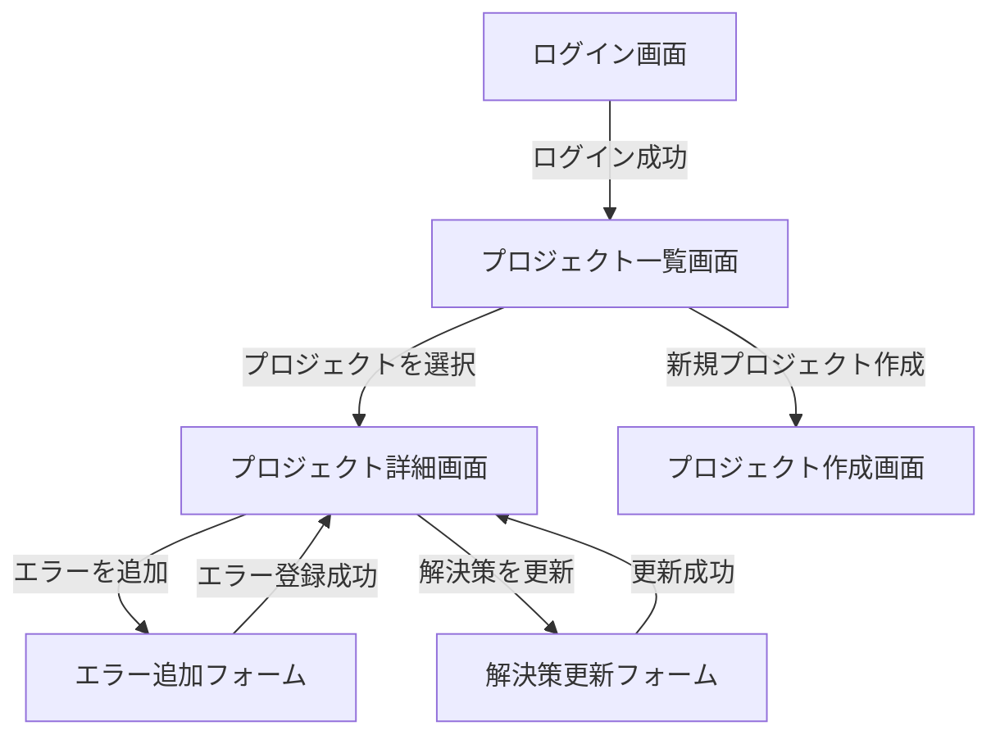

# Error Manager

## アプリ紹介
Error Managerは、プロジェクトに関連するエラーを登録、管理し、解決策を記録するためのアプリケーションです。このアプリケーションは、エラー管理を簡素化し、チーム間でのエラー情報共有を効率化することを目的としています。

## 機能
- プロジェクトの作成、編集、削除機能
- プロジェクトごとのエラーの登録・管理
- エラー検索機能（名前、説明での検索）
- エラーの詳細表示と解決策の記録
- ユーザー認証機能（ログイン必須）

## アプリケーションのアーキテクチャとフロー
アプリケーションは、Djangoフレームワークを使用して構築されており、MVCアーキテクチャを採用しています。データベースはPostgreSQLを使用しています。

---

## 画面遷移のリレーション図
以下はアプリケーションの画面遷移を示したフロー図です：



## バージョン管理
- **Python**: 3.8以上
- **Django**: 4.2.16
- **PostgreSQL**: 13以上
- **HTML5**: 最新仕様
- **CSS3**: 最新仕様

---

## 制作工程管理

### 1. 初期設定と計画
- 要件定義とデータベース設計を実施。
- Djangoプロジェクトのセットアップとアプリケーション構成を作成。

### 2. データベースおよびバックエンド実装
- ユーザー、プロジェクト、エラーのデータモデルを設計。
- プロジェクト管理機能とエラー登録機能を実装。

### 3. フロントエンド開発
- HTMLとCSSを用いたレスポンシブなUIを構築。
- JavaScriptを使用して動的機能を追加。

### 4. テストとバグ修正
- バックエンドとフロントエンドの単体テストを実施。
- ユーザーシナリオに基づく統合テスト。

### 5. デプロイメント
- 開発環境での動作確認後、本番環境にデプロイ。
- GitHubでのプロジェクト管理。

---

## 使用ツール
- **プロジェクト管理**: GitHub
- **開発環境**: Visual Studio Code
- **データベース**: PostgreSQL
- **テストフレームワーク**: Django Test Framework

---

## インストールと使用方法

### 1. リポジトリをクローンします：
```bash
git clone https://github.com/your-username/error-manager.git
```

## 2. 仮想環境を作成し、依存関係をインストールします：

### 仮想環境を作成
```bash
python3 -m venv error-manager-env
```

### 仮想環境をアクティベート
```bash
source error-manager-env/bin/activate
```

### 必要なパッケージをインストール
```bash
pip install -r requirements.txt
```

## 3. データベースをセットアップします
```bash
python manage.py migrate
```

## 4. 開発サーバーを起動します
```bash
python manage.py runserver
```
### ブラウザで http://127.0.0.1:8000 にアクセスしてアプリケーションを確認してください。


###テストの実行
###以下のコマンドで単体テストを実行できます：
```bash
python manage.py test
```

## ディレクトリ構成
```plaintext
error-manager/
├── errors/
│   ├── migrations/
│   ├── templates/
│   ├── tests.py
│   ├── views.py
│   └── models.py
├── projects/
│   ├── migrations/
│   ├── templates/
│   ├── tests.py
│   ├── views.py
│   └── models.py
├── users/
│   ├── migrations/
│   ├── templates/
│   ├── tests.py
│   ├── views.py
│   └── models.py
└── manage.py
```

## 今後の改善ポイント
### ユーザーインターフェースのさらなる改善。
### エラーの詳細検索やフィルタリング機能の追加。
### モバイル対応の最適化。
